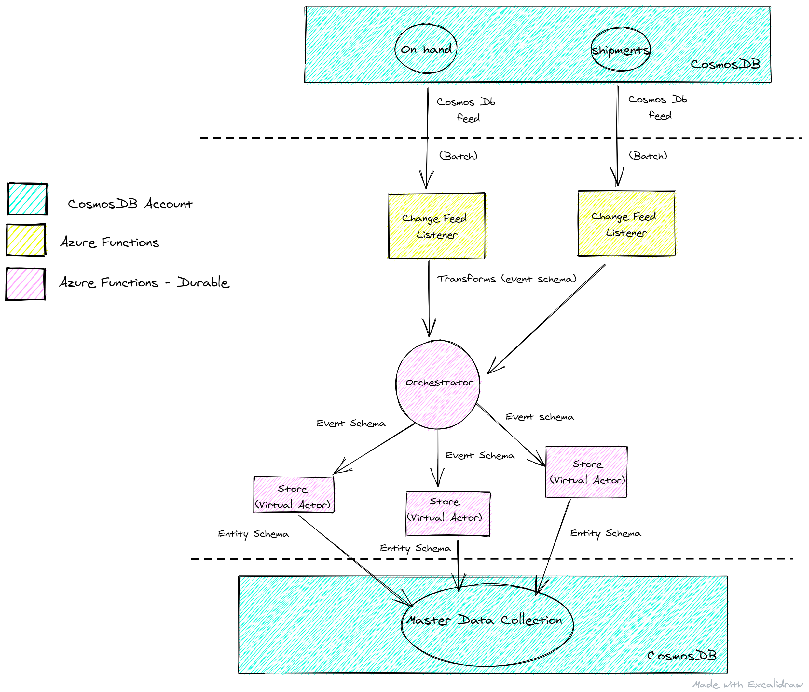
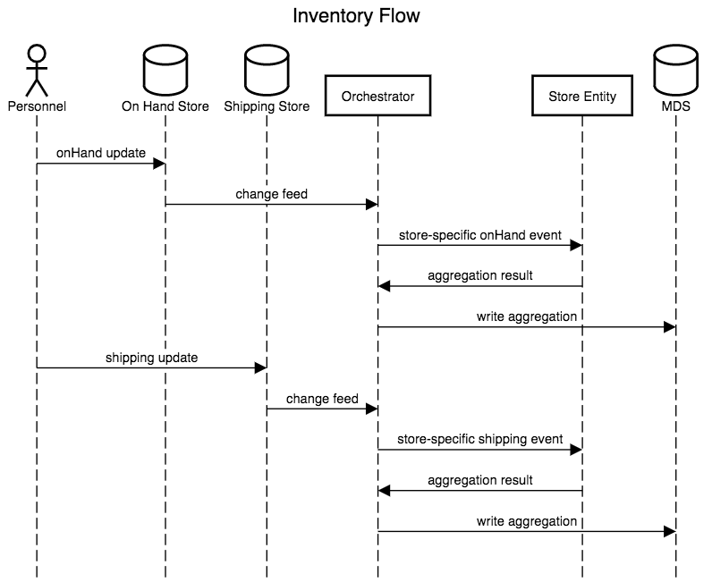

# Solution Design

## Introduction

While there are many ways to achieve the goal we are looking for, for the purpose of this Open Hack we are focusing on how to resolve this issue via a Virtual Actor model with the use of Azure Functions - Durable Entities.

## Components used and their roles

The following components will be used as part of the solution:

- Cosmos DB account
  - Cosmos DB database: `inventory`
    - Cosmos DB container: `onHand`
    - Cosmos DB container: `shipments`
    - Cosmos DB container: `mds` (master data store)
- Azure Functions
  - Two Cosmos DB change feed listeners - listening to `onHand` and `shipments` Cosmos DB containers, respectively
  - Durable Function Orchestrator
  - Durable Entities as a virtual actors representing each store and state of inventory in each store.

As part of the challenges, we will create the Cosmos DB account, Cosmos DB database and Cosmos DB containers on Azure and build the Azure Functions to process the changes.

## Processing Sequence

The following diagram describes the interaction between the various components:

The processing starts when documents are fed into the Cosmos DB containers (shipments and on hand), which triggers a change feed in Cosmos DB.

Azure Functions configured to listen to the feed get a list of documents which are added. The Change feed listener convert them to events.

The events are sent to Durable Entity orchestrator, which routes these event based on store identifier to the virtual actor representing the store.

The virtual actor processes the event and updates its states. It then commits the data to the Master Data Store container in Cosmos DB.

The sequence diagram for the on hand event, would look like this:

## Message Schemas and Examples

The message schemas define the structure of the messages exchanged between various components.

The [Data Store Message Schema Document](./message-schema-definitions.md) provides the structure of the On Hand and Shipment documents and the structure for the record for Master Data Store (MDS). They are essentially the input and output data contracts for the system and are **required** to be used in the defined fashion.

The [Suggested Event Schema](./suggested-event-schemas.md) document define one of the ways messages exchanged between the internal components (change feed listener to orchestrator to durable entities) can be structured. It is a recommendation, not a requirement.

## References

- [Azure Cosmos DB](https://azure.microsoft.com/en-us/free/cosmos-db/)
- [Azure Functions](https://azure.microsoft.com/en-us/services/functions/)
- [Azure Functions Triggers and Bindings](https://docs.microsoft.com/en-us/azure/azure-functions/functions-triggers-bindings)
- [Azure Functions - Durable Functions](https://docs.microsoft.com/en-us/azure/azure-functions/durable/durable-functions-types-features-overview)
- [Azure Functions - Durable Entities](https://docs.microsoft.com/en-us/azure/azure-functions/durable/durable-functions-entities?tabs=csharp)

## Next Step

Now that the design of the solution is clear, let's jump on to [Challenge 0](challenge-000.md) to set up your development environment.
