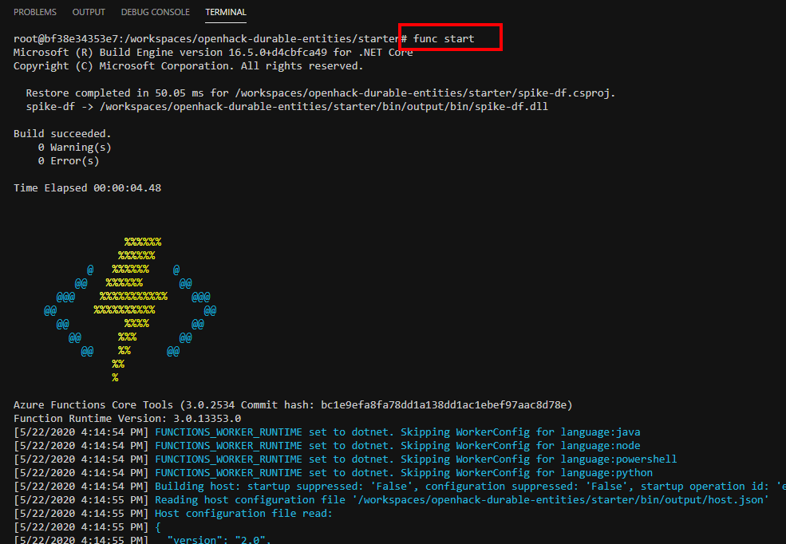
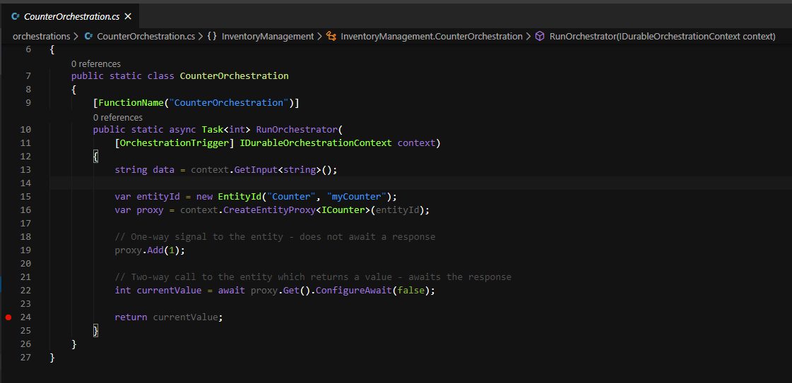
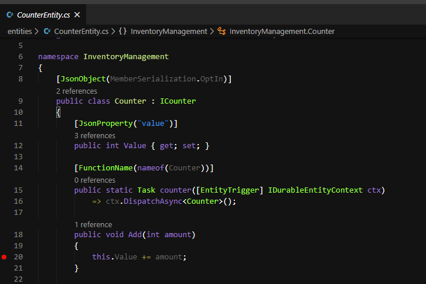
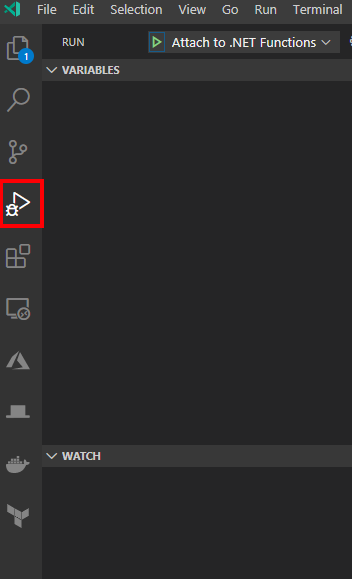
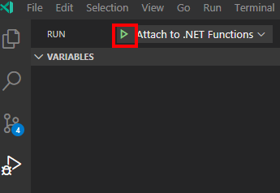
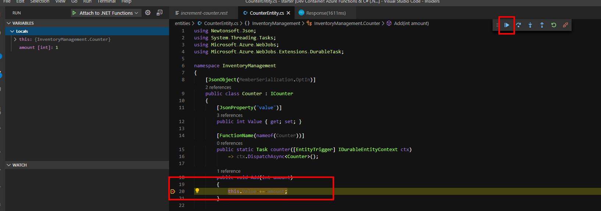
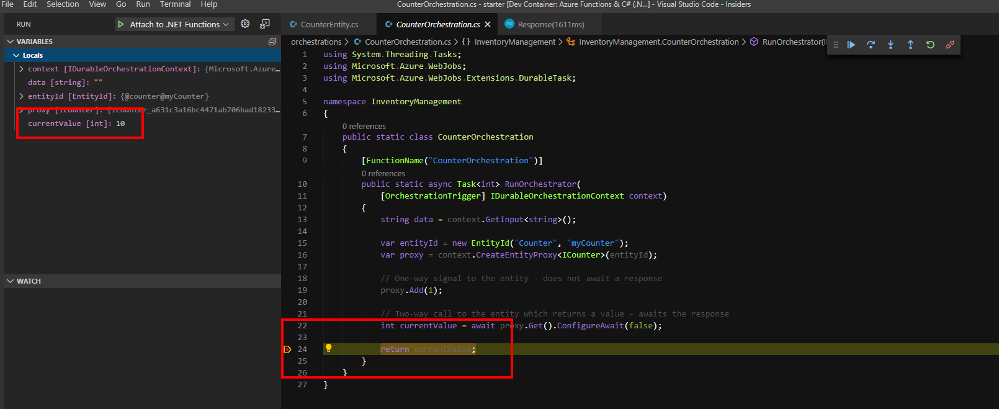

# Running and Debugging the Sample Code

[Return to root - README](../README.md)

## Introduction

This section steps you through the steps on how to run the Azure Functions code, previous configured with Azure Storage as the backend data store in the previous section.

## Running the function for the command line

1. On the terminal window in VS Code, navigate to `starter` folder, which is root of the function code.
2. On the command shell, type `func start`.
3. This should start the local Azure Function Host on the container and the output will look something like this:

    

4. Scrolling down the list, you will find, the HTTP entry point to start a durable orchestration to increment a counter.

    

5. We have that REST endpoint, stored in the file `increment-counter.rest`.
6. Open the file `increment-counter.rest` in the VS Code.
7. With the power of REST Client - VS Code Extension, you can make the HTTP call right from the VS Code, by click on the "Send Request" link, showing up above the request text.

    

8. Click on the "Send Request" link to make the the HTTP Request.
9. The response will contain a set of URLs associated with Orchestration to increment the counter.

    

10. Copy the URL associated with the key - `statusQueryGetUri` and open it on a browser on your machine.
11. The JSON output should show the value of the counter. (If running for the first time, the value will be one. The image below shows an output after a few orchestrations)

    

12. Congrats, we have successfully executed our Azure Functions - Durable Orchestration using Entity Function! We incremented a stateful counter.

## Debugging the code

The steps for debugging are similar to the running the functions host from command line, with the difference that instead of launching the host from command line, we use the Visual Studio debugger to the launch the function host and attach to it.

> **IMPORTANT**: Before launch the Azure Function Host with the debugger, close the instance launched previously from command line by pressing Ctrl+C on the terminal window, where the Azure Function host was started.

The starter code is already configured, with Visual Studio Code tasks for debugging the Azure Functions using Azure Functions Extension.  

1. Open and place the breakpoint in the following files and line, by clicking on the left side of the line number shown in the IDE
    - `orchestrations/CounterOrchestration.cs`, `line: 24`

        

    - `entities/CounterEntity.cs`, `line: 20`

        

2. Click on the "Run" icon the left panel to bring up the Run/Debug view.

    

3. Click on the "Run/Debug" icon or press "F5" to launch the debugger, which in turn will start the Azure Functions host.

    

4. A debug panel will appear on the top of the code window.

    

5. Once the application is ready, open the file `increment-counter.rest` in the VS Code.  
6. Click on the "Send Request" link to make the the HTTP Request.
7. Because the asynchronous nature of the orchestration, the response for the HTTP request, is likely to return before the breakpoints are hit, so wait for few seconds.
8. The debugger should hit the code in Entity function first. Press F5 to continue to next breakpoint or F10 to step through the code. You can use buttons on the debug panel to perform the same operations.

    

9. The debugger should hit the Orchestrator function next.
10. You can view the value of the "counter" variable on the left side of the screen, in the watch panel or by hover over the variable.

    

11. Press F5 to continue or click "Continue" button on the Debug Panel to complete this round of the debugging session.
12. Repeat the process from Step 5 again, you should see the counter continue to increment.
13. Click on the Stop button on the debugger panel to stop debugging.

    

14. With that, we have successfully debugged the Azure Function code and completed the final step.

## Resources

- [Code and test Azure Functions Locally](https://docs.microsoft.com/en-us/azure/azure-functions/functions-develop-local)
- [Quick start: Create a function in Azure using Visual Studio Code](https://docs.microsoft.com/en-us/azure/azure-functions/functions-create-first-function-vs-code?pivots=programming-language-csharp)
- [Create a function triggered by Azure Cosmos DB](https://docs.microsoft.com/en-us/azure/azure-functions/functions-create-cosmos-db-triggered-function)
- [Azure Functions - Durable Functions](https://docs.microsoft.com/en-us/azure/azure-functions/durable/durable-functions-overview?tabs=csharp)
- [Azure Functions - Entity Functions](https://docs.microsoft.com/en-us/azure/azure-functions/durable/durable-functions-entities?tabs=csharp)

## Next Steps

Looks like you are on your way to become a savvy Azure Functions Developer!

Review the [Challenge 0](../../docs/challenge-000.md) for the Open Hack and see, if you are done. (I think, you might be... :o)

But wait, wait...here's a hint, take a close look at the list of resources above, some of them might come handy in your next set of challenges.

Alternatively, return to [main README document](../README.md) or review [Step 1](./vscode-remote-development.md), setting up remote development environment using VS Code and Docker containers or [Step 2](./azurefunctions-storage-setup.md), setting up Azure Storage account for Azure Functions.
